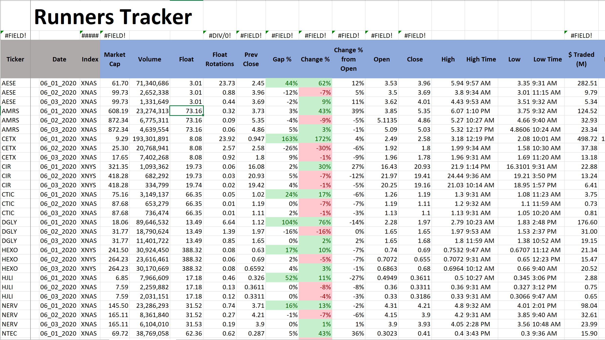
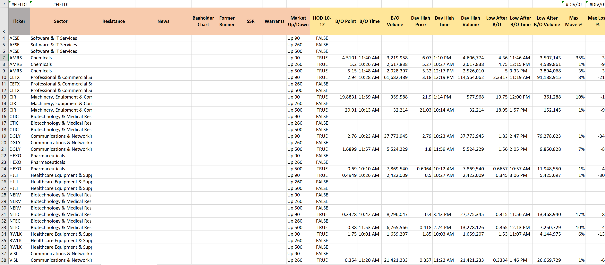
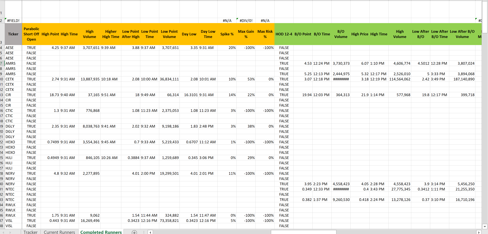
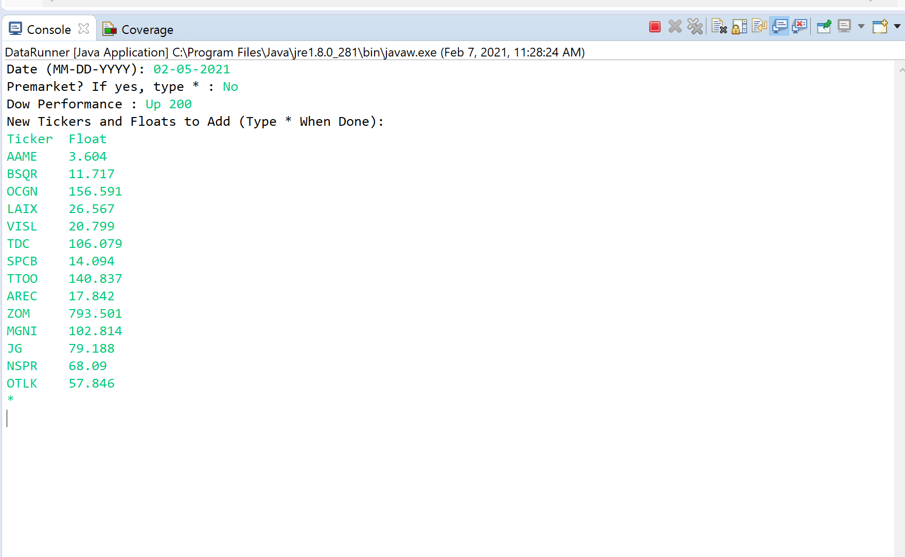

# stock-data-bot
This program uses AutoIt to manually import daily stock data from Fidelity Active Trader Pro and analyzes it within Java. Finally, it exports all patterns and alysis into an Excel Spreadsheet. 

Execution of the Program:

1) Takes in info about date, DOW performance, and other info needed at the start to execute
2) Takes in a list of Stock Tickers and their floats (I run a webscraper on TradingView from within Chrome Browser to easily get my stocks I want to parse and in the correct format). My criteria for stocks is if they move 30%+ on the day or gap up 15%+ from previous close. The program then also looks at past current runners from the Excel spreadsheet and gets the current day's data for those tickers as well.
3) Loads up Fidelity Active Trader Pro and uses AutoIt to simlate a user clicking and saving repeatedly each stock's price data for the day to a .csv file in a specified location.
4) Logs out of Fidelity Active Trader Pro
5) Gathers more info about each stock from user such as news, support/resistance, etc.
6) Once finished, it parses all the data obtained and loads it into an Excel spreadsheet. All data goes into the "Current Runners" page and is subsequently sorted. Included in this parsed data are about 5 pre specified patterns that it checks for such as +10% in first 5 minutes then falls, and it inputs the data about each of those patterns as well.
7) The sorted "Current Runners" page is now analyzed to see which stocks have lost their momentum (two consecutive red days). Then, all the data from these stocks get cut and pasted into the "Completed Runners" page. 
8) Finally, it wraps up everything by saving Excel and nserting the correct Excel formulas into correct cells.
9) Now, the user can open the Excel doc and have laods of data regarding that day's current stocks and he can't sort and filter as he pleases.

In summary, this program looks for stocks that are up big on the day and tracks them until they have two consecutive red days. Once they have two consecutive red days, all the data for that stock in those couple of days is moved to the "Completed" sheet to signify that the stock has made its run up and has lost its momentum.

Spreadsheet Example

